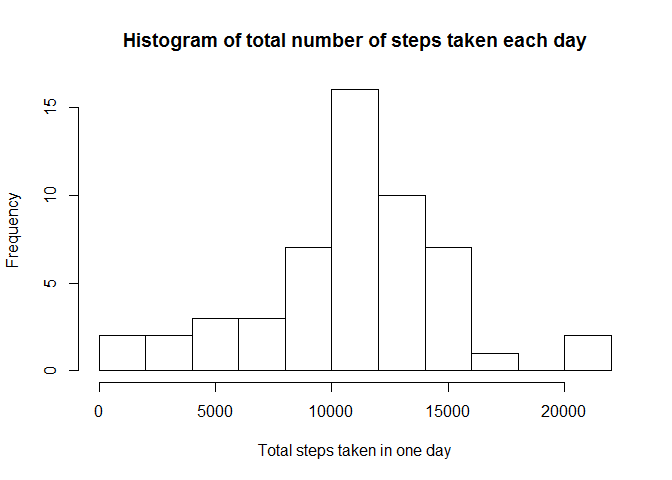
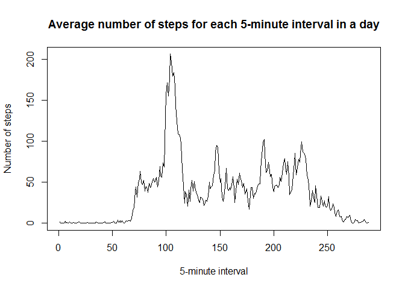
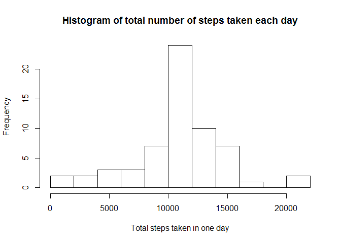
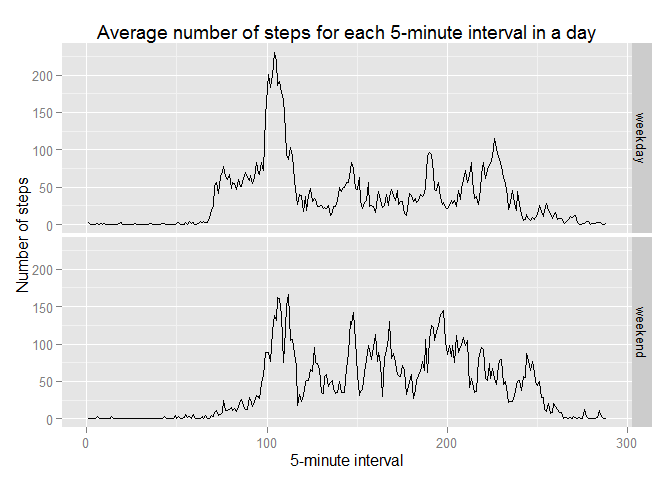

# Reproducible Research: Peer Assessment 1

## Introduction

This report answers the questions as given in the Assignment 1 of the Reproducible Research course. It presents the analysis of some data about personal movement recorded using activity monitoring devices. 

The document is generated using R Markdown on a Windows system:


```r
R.version[c("platform", "version.string")]
```

```
##                _                           
## platform       x86_64-w64-mingw32          
## version.string R version 3.2.0 (2015-04-16)
```

The following libraries are loaded:


```r
library(dplyr)
library(ggplot2)
```

## Loading and preprocessing the data

The data is checked into the *root folder* of the repository as activity.zip. The zip file contains the data file in CSV format (activity.csv).


```r
# Extract the data file.
if (!file.exists("activity.csv")) {
  unzip("activity.zip")
}

# Load the data.
activity <- read.csv("activity.csv", as.is = TRUE, na.strings = "NA")

# Convert the date to a workable format.
activity <- activity %>%
  mutate(date = as.Date(date))
```

## What is mean total number of steps taken per day?

For this question, we omit all rows that have NAs in them.


```r
# Find the total number of steps for each day.
total.steps <- activity %>%
  na.omit %>%  # dropping all NAs
  group_by(date) %>%
  summarise(steps = sum(steps))

# Plot the histogram for the total number of steps.
hist(total.steps$steps,
     breaks = 10,
     main = "Histogram of total number of steps taken each day",
     xlab = "Total steps taken in one day")
```

 

```r
# Find the mean of the total number of steps.
mean.steps <- mean(total.steps$steps)
mean.steps
```

```
## [1] 10766.19
```

```r
# Find the median.
median.steps <- median(total.steps$steps)
median.steps
```

```
## [1] 10765
```

The total number of steps taken per day has a mean value of 1.0766189\times 10^{4} and the median 10765.

## What is the average daily activity pattern?


```r
# Find the average number of steps for each 5-minute interval.
daily.pattern <- activity %>%
  na.omit %>%
  group_by(interval) %>%
  summarise(average = mean(steps)) %>%
  arrange(interval)
```

There should be a total of 288 5-minute intervals (the x-axis) over the span of 24 hours.


```r
# See if we have all the intervals available.
nrow(daily.pattern) == 24 * 60 / 5
```

```
## [1] TRUE
```

```r
# Plot the time series for the average number of steps.
plot(daily.pattern$average ~ row.names(daily.pattern),
     type = "l",
     main = "Average number of steps for each 5-minute interval in a day",
     xlab = "5-minute interval",
     ylab = "Number of steps")
```

 

```r
# Get the interval with maximum average number of steps.
max.avg.row <- which.max(daily.pattern$average)
max.avg.interval <- daily.pattern[[max.avg.row, 1]]
max.avg.interval
```

```
## [1] 835
```

On average across all the days in the dataset, the maximum number of steps occurs at interval number 104, which corresponds to the 5-minute interval starting at 835.

## Inputting missing values


```r
summary(activity)
```

```
##      steps             date               interval     
##  Min.   :  0.00   Min.   :2012-10-01   Min.   :   0.0  
##  1st Qu.:  0.00   1st Qu.:2012-10-16   1st Qu.: 588.8  
##  Median :  0.00   Median :2012-10-31   Median :1177.5  
##  Mean   : 37.38   Mean   :2012-10-31   Mean   :1177.5  
##  3rd Qu.: 12.00   3rd Qu.:2012-11-15   3rd Qu.:1766.2  
##  Max.   :806.00   Max.   :2012-11-30   Max.   :2355.0  
##  NA's   :2304
```

There are 2304 NAs in the steps variable.

The strategy chosen to fill in the missing values is to replace NAs with the corresponding mean value for that 5-minute interval.


```r
# Get the replacement values (mean average steps for the interval).
na.replacement <- activity %>%
  filter(is.na(steps)) %>%
  mutate(replace = sapply(interval, function(x) {
    as.data.frame(daily.pattern)[daily.pattern$interval == x, "average"]
  }))

# Create a new dataset with the NAs filled in.
activity.filled <- activity  # make a copy
activity.filled[is.na(activity.filled$steps), "steps"] <- na.replacement$replace

# Do a quick check.
all(!is.na(activity.filled))
```

```
## [1] TRUE
```

```r
# Find the total number of steps for each day.
total.steps.filled <- activity.filled %>%
  group_by(date) %>%
  summarise(steps = sum(steps))

# Plot the histogram for the total number of steps.
hist(total.steps.filled$steps,
     breaks = 10,
     main = "Histogram of total number of steps taken each day",
     xlab = "Total steps taken in one day")
```

 

```r
# Find the mean of the total number of steps.
mean.steps.filled <- mean(total.steps.filled$steps)
mean.steps.filled
```

```
## [1] 10766.19
```

```r
# Find the median.
median.steps.filled <- median(total.steps.filled$steps)
median.steps.filled
```

```
## [1] 10766.19
```

There is no difference in the mean of the total number of steps. However, the median has changed from 10765 to become the same as the mean value.

This is kind of expected for this particular dataset, because when you look at each day individually, either all the rows come with NAs, or every row contains valid data. In other words, we are essentially replacing each "NA" day with an "average" day, so the overall mean should not be affected.


```r
# Verify that for each day, you either get all data or no data at all.
activity %>%
  group_by(date) %>%                            # check for each day whether ...
  summarise(all.na = all(is.na(steps)),         # ... all steps are NA
            all.filled = all(!is.na(steps)),    # ... all steps are not NA
            exclusive = xor(all.na, all.filled)) %>%  # either condition is true
  summarise(all(exclusive))                     # whether it's true for all days
```

```
## Source: local data frame [1 x 1]
## 
##   all(exclusive)
## 1           TRUE
```

```r
# Get the number of days with all/no data.
activity %>%
  group_by(is.na(steps), date) %>%
  summarise(count = n()) %>%  # rows per day should equal 288
  summarise(days = n(), all(count == 288))
```

```
## Source: local data frame [2 x 3]
## 
##   is.na(steps) days all(count == 288)
## 1        FALSE   53              TRUE
## 2         TRUE    8              TRUE
```

## Are there differences in activity patterns between weekdays and weekends?


```r
# Determine whether the day is a weekday or weekend.
activity.filled <- activity.filled %>%
  mutate(day.type = ifelse(weekdays(date) %in% c("Saturday", "Sunday"),
                           "weekend",
                           "weekday"),
         day.type = factor(day.type))

# Plot the panel of weekday/weekend time series for average number of steps for
# each 5-minute interval.
activity.filled %>%
  group_by(day.type, interval) %>%
  summarise(average = mean(steps)) %>%
  arrange(day.type, interval) %>%
  qplot(c(1:288, 1:288),
        average,
        data = .,
        geom = "line",
        facets = day.type ~ .,
        main = "Average number of steps for each 5-minute interval in a day",
        xlab = "5-minute interval",
        ylab = "Number of steps") %>%
  print
```

 

Activity tends to climb slower at the beginning of the day during weekends, and appears to be more evenly spread out over the day. Whereas for weekdays, there is an outstanding peak at around 8.30am.
